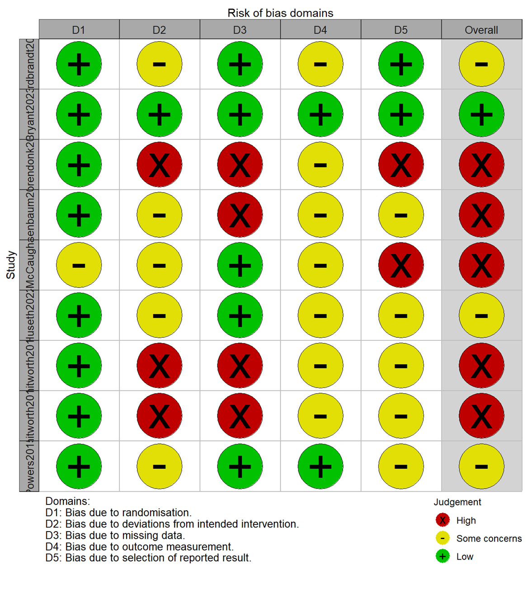

```{r  setup, error=FALSE, warning=FALSE, message=FALSE, include=FALSE}

#Load package 'meta' to run meta-analyses.
library(meta)
library(tidyr)
library(tibble)
library(stringr)
library(readxl)
library(grid)
library(dplyr)
library(Matrix)
library(knitr)
library(kableExtra)
library(rms) 
library(meta)
library(devtools)
library(tools)
library(metafor)
library(gtools)
library(metasens)
library(robvis)
library(PRISMA2020)

setwd("C:/Users/simon/Desktop/Github rep/LSR2_exercise_H/")

load("data/data_2023-12-4_LSR2_Awks2.RData")
load("data/LSR2weeksStata2insufdata.RData")

load("data/LSR2_studychartab_wks_140124.RData")
load("data/LSR2_studychartab_insuf_140124.RData")

load("data/LSR2_interventions_150224.RData")

## prisma<-read.csv("data/LSR3_H_PRISMA_2024.01.23.csv") #csv file for the prisma2020 -->
## prisma<-PRISMA_data(prisma) 

#risk of bias data
rob <- read_xlsx("data/LSR2_robptsd_260124.xlsx")

#PRISMA data
prisma <- read_xlsx("data/LSR2_H_PRISMA_100344.xlsx")
prisma<-PRISMA_data(prisma)

#SoE data
LSR2_SoE_250324 <- read_xlsx("data/LSR2_SoE_250324.xlsx")

#Round off results to two digits
settings.meta(digits = 2)

#add ROB variable "high" (no = low/some concerns; yes = high)
data_2023_12_4_LSR2_Awks2$high <- c("no", "yes" , "no" , "yes" , "no" , "yes" , "yes", "yes" , "yes")

#create subset for ROB sensitivity analysis: select studies with treatments "OLA" and "PLA"
data.rob.sens = subset(data_2023_12_4_LSR2_Awks2, high == "no")

LSR2_interventions_150224$Study[LSR2_interventions_150224$Study == "Whitworth2018"] <- "Whitworth2019a"
LSR2_interventions_150224$Study[LSR2_interventions_150224$Study == "Whitworth2019"] <- "Whitworth2019b"

data_2023_12_4_LSR2_Awks2$study[data_2023_12_4_LSR2_Awks2$study == "Whitworth2018"] <- "Whitworth2019a"
data_2023_12_4_LSR2_Awks2$study[data_2023_12_4_LSR2_Awks2$study == "Whitworth2019"] <- "Whitworth2019b"

```

# Results

We identified 11870 records. The PRISMA flow diagram is presented in Figuare 1. A total of `r length(table(data_2023_12_4_LSR2_Awks2$studyN))+length(table(LSR2weeksStata2insufdata$studyN))` studies with data from `r sum(data_2023_12_4_LSR2_Awks2$totNrandom, na.rm=T)+ sum(LSR2weeksStata2insufdata$totNrandom, na.rm=T)` participants were eligible for inclusion.The additional texts included secondary analyses, abstracts, trial registries, and protocol papers.

```{r echo=F, warning=F, fig.fullwidth=T, fig.width=12, fig.height=8}
PRISMA_flowdiagram(prisma, previous = FALSE, other=FALSE)
```

**Figure 1:** PRISMA flow diagram

## Study description

10 of the studies were RCTs, and 1 was a crossover RCT (Greene & Petruzzello, 2022).The specific intervention and comparison groups for the `r length(table(data_2023_12_4_LSR2_Awks2$studyN))+length(table(LSR2weeksStata2insufdata$studyN))` eligible studies (`r length(table(data_2023_12_4_LSR2_Awks2$study))+length(table(LSR2weeksStata2insufdata$study))` comparisons) are presented in Table 1.

```{r echo=FALSE}
knitr::kable(LSR2_interventions_150224[, 1:7], "pipe")
```

*Aerobic = physical performance behaviour pattern that increases heart rate and respiration while using large muscle groups repetitively and rhythmically; anaerobic = physical performance behaviour pattern that is performed in short intense bursts with limited oxygen intake; mixed = combination of aerobic and anaerobic exercise. TAU = treatment as usual; WLC = waiting list control.*

**Table 1:** Specific interventions for all the included studies

`r length(table(data_2023_12_4_LSR2_Awks2$studyN))` of the `r  length(table(data_2023_12_4_LSR2_Awks2$studyN)) + length(table(LSR2weeksStata2insufdata$studyN))` studies were included in the meta-analyses (Bryant et al., 2023; Huseth, 2021; Nordbrandt et al., 2020; Rosenbaum et al., 2015; Voorendonk et al., 2023; Whitworth et al., 2019a; Whitworth et al., 2019b; Young-McCaughan et al., 2022). Meta-analysis was not feasible for `r length(table(LSR2weeksStata2insufdata$studyN))` of the `r length(table(data_2023_12_4_LSR2_Awks2$studyN))+length(table(LSR2weeksStata2insufdata$studyN))` studies (Crombie et al., 2021a; Greene & Petruzzello, 2022; Powers et al., 2015). Three of the studies provided follow-up PTSD outcome data which were insufficient for synthesis, which were synthesized descriptively without meta-analysis (Crombie et al., 2021a; Greene & Petruzzello, 2022; Powers et al., 2015). Three studies examined putative mediators which was not sufficient to carry out a meta-analysis (Crombie et al., 2021a; Powers et al., 2015; Whitworth et al., 2019a).

Study characteristics of the `r length(table(data_2023_12_4_LSR2_Awks2$studyN))` studies included in the meta-analysis are are presented in Table 2. From these `r length(table(data_2023_12_4_LSR2_Awks2$studyN))` studies, there were `r length(table(data_2023_12_4_LSR2_Awks2$study))` eligible comparisons. One study presented findings from two independent comparisons, including a total of four distinct intervention groups (Young-McCaughan et al., 2022). One of the first authors published findings from two different but methodologically similar trials in the same year (Whitworth et al., 2019a; Whitworth et al., 2019b).

```{r echo=FALSE}
knitr::kable(LSR2_studychartab_wks_140124[, 1:13], "pipe")
```

*TAU = treatment as usual; WLC = waiting list control; CAPS-IV = Clinician-Administered PTSD Scale - 4th edition; PCL-4 = PTSD Checklist - version 4; PCL-5 = PTSD Checklist - version 5; PDS-5 = Posttraumatic Diagnostic Scale -- version 5; HTQ = Harvard Trauma Questionnaire; Aerobic exercise = physical performance behaviour pattern that increases heart rate and respiration while using large muscle groups repetitively and rhythmically; anaerobic exercise = physical performance behaviour pattern that is performed in short intense bursts with limited oxygen intake; mixed exercise = combination of aerobic and anaerobic exercise; USA = United States of America.*

**Table 2:** Study characteristics of the `r length(table(data_2023_12_4_LSR2_Awks2$studyN))` studies included in the meta-analysis.

Study characteristics of the `r length(table(LSR2weeksStata2insufdata$studyN))` studies not included in the meta-analysis are are presented (Extended data). From these `r length(table(LSR2weeksStata2insufdata$studyN))` studies, there were `r length(table(LSR2weeksStata2insufdata$study))` eligible comparisons. One study reported two comparisons (Greene & Petruzzello, 2022).

```{r echo=FALSE}
knitr::kable(LSR2_studychartab_insuf_140124[, 1:10], "pipe")
```

*Aerobic exercise = physical performance behaviour pattern that increases heart rate and respiration while using large muscle groups repetitively and rhythmically; anaerobic exercise = physical performance behaviour pattern that is performed in short intense bursts with limited oxygen intake; USA = United States of America.*

**Table 3:** Study characteristics of the `r length(table(LSR2weeksStata2insufdata$studyN))` studies not included in the meta-analysis.

## Primary outcome

### PTSD Symptom Severity

For the studies included in the meta-analyses, the earliest study was performed in `r format(min((data_2023_12_4_LSR2_Awks2$year)), format="%Y")`, while the most recent study was performed in `r format(max((data_2023_12_4_LSR2_Awks2$year)), format="%Y")`. The median sample size across the studies was `r round(median(data_2023_12_4_LSR2_Awks2$totNrandom, na.rm=T))` participants per study. The median of the mean participant age was `r round(median((data_2023_12_4_LSR2_Awks2$AGEm), na.rm=T))` years (ranging from `r round(min((data_2023_12_4_LSR2_Awks2$AGEm),na.rm=T))` to `r round(max((data_2023_12_4_LSR2_Awks2$AGEm),na.rm=T))` years).

#### Post-intervention (weeks)

`r length(table(data_2023_12_4_LSR2_Awks2$studyN))` studies provided data for PTSD symptom severity and contributed `r length(data_2023_12_4_LSR2_Awks2$tg1PTSD3PTm)` effect measures to the PTSD symptom severity meta-analysis. The forest plot for PTSD symptom severity is presented in Figure 2.

```{r echo=FALSE, fig.fullwidth=T, fig.width=11, fig.height=4}
#SUMMARIZE the SMDs from studies using metacont & POOL the data 
LSR2mainMA = metacont(tg1PTSD3PTn , tg1PTSD3PTm ,tg1PTSD3PTsd ,tg2PTSD3PTn, tg2PTSD3PTm, tg2PTSD3PTsd ,
                      data = data_2023_12_4_LSR2_Awks2, studlab = study, sm = "SMD")

forest(LSR2mainMA, 
       sortvar = Intervention,
       common = FALSE,
       print.I2.ci = T, 
       prediction=T,
       label.left = 'Favours exercise',
       label.right = "Favours comparison",
       leftcols = c("study", "Intervention", "Comparison"),
       rightcols = c("effect", "ci"),
       fs.study = 10, ff.study = "italic",
       col.diamond = "blue", col.diamond.lines = "black",
       col.square = "turquoise", col.square.lines = "black")
```

**Figure 2:** Meta-analysis of the effects of exercise on PTSD symptom severity.

The meta-analysis found no evidence of a difference in PTSD symptom severity reduction between exercise and comparison groups (`r paste0(LSR2mainMA$sm, " = ", round(LSR2mainMA$TE.random, 2), ", 95% CI ", round(LSR2mainMA$lower.random, 2), " to ", round(LSR2mainMA$upper.random, 2))`). Low heterogeneity was found as suggested by the prediction interval which is only slightly wider than the confidence interval.

#### Subgroup Analyses and Meta-regressions

We explored whether heterogeneity could be potentially explained by differences in study-level characteristics using subgroup analyses and meta-regressions. The following characteristics were explored as sources of heterogeneity for the primary outcome, PTSD symptom severity:

-   Exercise intensity (moderate intensity or high intensity)

-   Specific exercise type (aerobic, anaerobic or mixed)

-   Exercise augmented by treatment as usual (TAU)/therapy (exercise only or exercise + therapy/TAU)

-   Intervention length (weeks)

##### Subgroup analysis by exercise intensity

The test for interaction found some evidence of a difference between studies with moderate intensity and those with high-intensity exercise  (Figure 3). Visual inspection of the forest plot suggests that effect is larger in the high intensity exercise subgroup.

```{r echo=FALSE, fig.fullwidth=T, fig.width=11, fig.height=6}
subgroup.intensity = update(LSR2mainMA, subgroup = intensityEX2) 

# produce a forest plot
forest(subgroup.intensity, 
       sortvar = Intervention,
       common = FALSE,
       print.I2.ci = T, 
       prediction=T,
       label.left = 'Favours exercise',
       label.right = "Favours comparison",
       leftcols = c("study", "Intervention", "Comparison"),
       rightcols = c( "effect", "ci"),
       fs.study = 10, ff.study = "italic",
       col.diamond = "blue", col.diamond.lines = "black",
       col.square = "turquoise", col.square.lines = "black")
```

**Figure 3:** Sub-group analysis of the effects of exercise on PTSD symptom severity by exercise intensity

##### Subgroup analysis by specific exercise type

The test for interaction found no evidence of a difference in PTSD severity between aerobic, anaerobic, or mixed exercise groups (Figure 4).

```{r echo=FALSE, fig.fullwidth=T, fig.width=11, fig.height=6}
# create a new R object subgroup.tg1specEX  
subgroup.tg1specEX = update(LSR2mainMA, subgroup = tg1specEX2) 

# produce a forest plot 
forest(subgroup.tg1specEX, 
       sortvar = Intervention,
       common = FALSE,
       print.I2.ci = T, 
       prediction=T,
       label.left = 'Favours exercise',
       label.right = "Favours comparison",
       leftcols = c("study", "Intervention", "Comparison"),
       rightcols = c( "effect", "ci"),
       fs.study = 10, ff.study = "italic",
       col.diamond = "blue", col.diamond.lines = "black",
       col.square = "turquoise", col.square.lines = "black")
```

**Figure 4:** Sub-group analysis of the effects of exercise on PTSD symptom severity by specific exercise type

##### Subgroup analysis by exercise alone or tau/therapy augmented by exercise.

The test for interaction found some evidence of a difference between exercise alone compared with those with exercise in addition to psychotherapy or TAU (Figure 5). Visual inspection of the forest plot suggests that effect is larger for studies with exercise alone.

```{r echo=FALSE, fig.fullwidth=T, fig.width=11, fig.height=6}
# create a new R object subgroup.EXEaug  
subgroup.EXEaug = update(LSR2mainMA, subgroup = EXEaug2) 

# produce a forest plot using the JAMA layout.
forest(subgroup.EXEaug, 
       sortvar = Intervention,
       common = FALSE,
       print.I2.ci = T, 
       prediction=T,
       label.left = 'Favours exercise',
       label.right = "Favours comparison",
       leftcols = c("study", "Intervention", "Comparison"),
       rightcols = c( "effect", "ci"),
       fs.study = 10, ff.study = "italic",
       col.diamond = "blue", col.diamond.lines = "black",
       col.square = "turquoise", col.square.lines = "black")
```

**Figure 5:** Sub-group analysis of the effects of exercise on PTSD symptom severity by exercise alone or TAU/therapy augmented by exercise

##### Meta-regression by intervention length

```{r echo=FALSE, fig.fullwidth=T, fig.width=11, fig.height=4}

# Do a meta-regression with the continuous covariate intervLENGTH (lenth of intervention - weeks) 

 intervLENGTHreg = metareg(LSR2mainMA, intervLENGTH) 

```

Overall, there is no evidence that the intervention length affected the treatment effect (Figure 6). The meta-regression analysis yielded a coefficient of `r round(intervLENGTHreg$beta[2], 2)` (95% CI: `r round(intervLENGTHreg$ci.lb[2], 2)`, `r round(intervLENGTHreg$ci.ub[2], 2)`).). Intervention length ranged from 3 weeks to 20 weeks, with a mode and median of 8 weeks. 

```{r echo=FALSE, fig.fullwidth=T, fig.width=11, fig.height=4}

# generate a bubble plot. 

bubble(intervLENGTHreg, col.line = "blue", xlab = "Intervention Length (Weeks)") 

```

**Figure 6:** Meta-regression of the effects of exercise on PTSD symptom severity by intervention length

##### **Heterogeneity explained by covariates**

|       Moderator       |          Category          |                     $\beta$                     |                                                  95% CI                                                  |                  𝞽^2^                   |
|:-------------:|:-------------:|:-------------:|:-------------:|:-------------:|
|    Overall effect     |            *-*             |       `r round(LSR2mainMA$TE.random, 2)`        |              `r round(LSR2mainMA$lower.random, 2)` to `r round(LSR2mainMA$upper.random, 2)`              |       `r round(LSR2mainMA$tau2)`        |
|  Exercise intensity   |            *-*             |                       \-                        |                                                    \-                                                    |                   \-                    |
|                       |         *Moderate*         | `r round(subgroup.intensity$TE.random.w[2], 2)` | `r round(subgroup.intensity$lower.random.w[2], 2)` to `r round(subgroup.intensity$upper.random.w[2], 2)` | `r round(subgroup.intensity$tau2.w[2])` |
|                       |           *High*           | `r round(subgroup.intensity$TE.random.w[1], 2)` | `r round(subgroup.intensity$lower.random.w[1], 2)` to `r round(subgroup.intensity$upper.random.w[1], 2)` | `r round(subgroup.intensity$tau2.w[1])` |
|     Exercise type     |            *-*             |                       \-                        |                                                    \-                                                    |                   \-                    |
|                       |         *Aerobic*          | `r round(subgroup.tg1specEX$TE.random.w[1], 2)` | `r round(subgroup.tg1specEX$lower.random.w[1], 2)` to `r round(subgroup.tg1specEX$upper.random.w[1], 2)` | `r round(subgroup.tg1specEX$tau2.w[1])` |
|                       |        *Anaerobic*         | `r round(subgroup.tg1specEX$TE.random.w[3], 2)` | `r round(subgroup.tg1specEX$lower.random.w[3], 2)` to `r round(subgroup.tg1specEX$upper.random.w[3], 2)` | `r round(subgroup.tg1specEX$tau2.w[3])` |
|                       |          *Mixed*           | `r round(subgroup.tg1specEX$TE.random.w[2], 2)` | `r round(subgroup.tg1specEX$lower.random.w[2], 2)` to `r round(subgroup.tg1specEX$upper.random.w[2], 2)` | `r round(subgroup.tg1specEX$tau2.w[2])` |
| Exercise augmentation |            *-*             |                       \-                        |                                                    \-                                                    |                   \-                    |
|                       |      *Exercise alone*      |  `r round(subgroup.EXEaug$TE.random.w[2], 2)`   |    `r round(subgroup.EXEaug$lower.random.w[2], 2)` to `r round(subgroup.EXEaug$upper.random.w[2], 2)`    |  `r round(subgroup.EXEaug$tau2.w[2])`   |
|                       | *TAU/therapy + augmented*  |  `r round(subgroup.EXEaug$TE.random.w[1], 2)`   |    `r round(subgroup.EXEaug$lower.random.w[1], 2)` to `r round(subgroup.EXEaug$upper.random.w[1], 2)`    |  `r round(subgroup.EXEaug$tau2.w[1])`   |
|  Intervention length  | *per unit (Week) increase* |     `r round(intervLENGTHreg$beta[2,], 2)`      |             `r round(intervLENGTHreg$ci.lb[2], 2)` to `r round(intervLENGTHreg$ci.ub[2], 2)`             |   `r round(intervLENGTHreg$tau2, 2)`    |

#### Sensitivity Analyses

```{r echo=FALSE, fig.fullwidth=T, fig.width=11, fig.height=4}
#SUMMARIZE the SMDs from studies using metacont 
rob.sens.MA = metacont(tg1PTSD3PTn , tg1PTSD3PTm ,tg1PTSD3PTsd ,tg2PTSD3PTn, tg2PTSD3PTm, tg2PTSD3PTsd ,
                      data = data.rob.sens, studlab = study, sm = "SMD")
```

We examine the robustness of the findings for the primary outcome by excluding studies with high risk of bias (Figure 7). `r length(table(data.rob.sens$study))` studies included in the meta-analyses were rated as low or some concerns. When restricting the analysis to studies with moderate or low risk of bias, the effect of exercise on PTSD symptoms severity was `r paste(rob.sens.MA$sm, "=", round(rob.sens.MA$TE.random, 2),"(95% CI:", round(rob.sens.MA$lower.random, 2), ",", round(rob.sens.MA$upper.random, 2))`). For reference, the main effect size for the primary outcome was `r paste(LSR2mainMA$sm, "=", round(LSR2mainMA$TE.random, 2),"(95% CI:", round(LSR2mainMA$lower.random, 2), ",", round(LSR2mainMA$upper.random, 2))`), so the results do not change substantially.

```{r echo=FALSE, fig.fullwidth=T, fig.width=11, fig.height=4}
#POOL the data 
forest(rob.sens.MA, 
       sortvar = EXEaug,
       common = FALSE,
       print.I2.ci = T,
       label.left = 'Favours exercise',
       label.right = "Favours comparison",
       leftcols = c("study", "Intervention", "Comparison"),
       rightcols = c("effect", "ci"),
       fs.study = 10, ff.study = "italic",
       col.diamond = "blue", col.diamond.lines = "black",
       col.square = "turquoise", col.square.lines = "black")
```

**Figure 7:** Meta-analysis of the effects of exercise on PTSD symptom severity when excluding studies with high risk of bias

#### Reporting bias

Visual inspection of the funnel plot of standard error Hedges' g suggested possible publication bias in favour the of exercise group. 

```{r echo=FALSE, fig.fullwidth=T, fig.width=11, fig.height=3}
 #Produce a funnel plot 
funnel(LSR2mainMA, pch = 16,
       contour = c(0.9, 0.95, 0.99),
       col.contour = c("green", "yellow", "pink")) 

legend(0.25, 1.25,
       c("0.1 > p > 0.05", "0.05 > p > 0.01", "< 0.01"),
       fill = c("green", "yellow", "pink"), bty = "n")
```

There was insufficient studies to test for small study effect. The forest plot below shows the meta-analysis results of the primary outcome, PTSD symptom severity, ordered by the precision of the studies is presented in Figure 8. The smaller studies showed larger effects favoring the exercise groups compared to the larger studies which cluster around the line of no effect. 

```{r echo=FALSE, fig.fullwidth=T, fig.width=11, fig.height=4}
# forest polot ordered by precision

forest(LSR2mainMA, 
       sortvar = seTE,
       common = FALSE,
       print.I2.ci = T, 
       prediction=T,
       label.left = 'Favours exercise',
       label.right = "Favours comparison",
       leftcols = c("study", "Intervention", "Comparison"),
       rightcols = c("effect", "ci"),
       fs.study = 10, ff.study = "italic",
       col.diamond = "blue", col.diamond.lines = "black",
       col.square = "turquoise", col.square.lines = "black")
```

**Figure 8:** Forest plot of the meta-analysis results of the primary outcome ordered by the precision of the studies


***add PTSD severity SWiM when finalized***

#### Risk of bias for the PTSD symptom severity

The results of the risk of bias assessment per domain and study for the primary outcome, PTSD symptom severity is presented below in Figure 9 of the Extended Data. Nine studies reported PTSD outcome data post-intervention. Two studies did not report PTSD outcome data (Crombie et al., 2021a; Greene & Petruzzello, 2022). Five of the nine studies had an overall high risk of bias, three had some concerns, and only one was had low risk of bias. High risk of bias was mainly due to deviations from intended intervention (D2)(Voorendonk et al., 2023; Whitworth et al., 2019a; Whitworth et al., 2019b), missing outcome data (D3)(Rosenbaum et al., 2015; Voorendonk et al., 2023; Whitworth et al., 2019a; Whitworth et al., 2019b), and selection of reported results (D5)(Voorendonk et al., 2023; Young-McCaughan et al., 2022).

```{r echo=F, warning=F}

rob_traffic_light(data = rob , tool = "ROB2")

```

**Figure 9** Results of the risk of bias assessment per domain and overall for the PTSD severity outcome


------------------------------------------------------------------------

## Secondary outcomes

### Treatment Dropout

#### Post-intervention (weeks)

`r length(table(data_2023_12_4_LSR2_Awks2$studyN))` studies provided data for treatment dropout, and contributed `r length(data_2023_12_4_LSR2_Awks2$tg1Ndrop)` effect measures to the treatment dropout meta-analysis. The forest plot for the risk of treatment dropout presented in Figure 10.

```{r echo=F, fig.fullwidth=T, fig.width=11, fig.height=4}
#Summarize the study-specific risk ratios for study completors from studies using metabin
#create an object of class meta called “pooledRRdrop”
pooledRRdrop = metabin(tg1Ndrop, tg1Nrandom,	tg2Ndrop,tg2Nrandom,
                       data = data_2023_12_4_LSR2_Awks2, studlab = study, sm = "RR")

#obtain the forest plot 
forest(pooledRRdrop, 
       sortvar = Intervention,
       common = FALSE,
       print.I2.ci = T, 
       prediction=T,
       label.left = 'Favours exercise',
       label.right = "Favours comparison",
       leftcols = c("study", "Intervention", "Comparison"),
       rightcols = c("effect", "ci"),
       fs.study = 10, ff.study = "italic",
       col.diamond = "blue", col.diamond.lines = "black",
       col.square = "turquoise", col.square.lines = "black")


```

**Figure 10:** Meta-analysis of the dropout rates between the intervention and control groups

No evidence of a difference in treatment dropout between exercise and comparison groups (`r paste0(pooledRRdrop$sm, " = ", round(exp(pooledRRdrop$TE.random), 2), ", 95% CI ", round(exp(pooledRRdrop$lower.random), 2), " to ", round(exp(pooledRRdrop$upper.random), 2))`) was found and there was large heterogeneity, as shown by the prediction interval (`r paste(round(exp(pooledRRdrop$lower.predict), 2), "to", round(exp(pooledRRdrop$upper.predict), 2))`).

**add secondary outcome SWiM when finalized**

------------------------------------------------------------------------

**add mediation studies SWiM when finalized**

#### Risk of bias for the mediation studies

The results of the risk of bias assessment for the mediation analyses are presented in Figure 11. Even though two of the three mediation studies had only some concerns within the non-mediation-specific (D1-D5) components of the revised ROB2 tool (Crombie et al.,2021a; Powers et al., 2015), all of the three studies had an overall high risk of bias mainly due to the deviations in mediation-specific domains (D6-D9) (Crombie et al.,2021a; Powers et al., 2015; Whitworth et al., 2019). In the domains (D7 and D8), 100% of the mediation studies had a high risk of bias underscoring the current methodological limitation in mediation analysis and handling confounding in mediation studies (Crombie et al.,2021a; Powers et al., 2015; Whitworth et al., 2019).

```{r echo=FALSE}


```

**Figure 11** Results of the risk of bias assessment per domain and overall for the mediation outcomes

# SUMMARY OF THE EVIDENCE

The primary outcome was efficacy in reducing overall PTSD symptom severity in patients with PTSD. The summary of the evidence on PTSD symptom severity outcome for PTSD is reported below.

```{r echo=FALSE}
knitr::kable(LSR2_SoE_250324[, 1:6])
```
